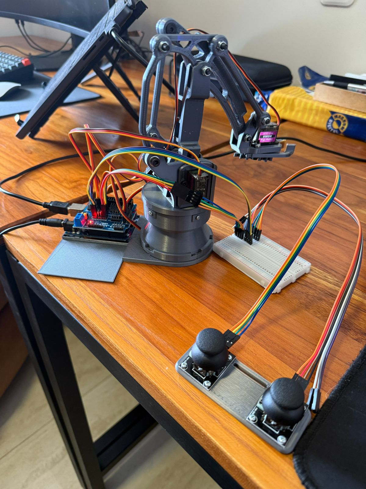

# ardu-arm

Control a robotic arm using Arduino and dual joysticks.

## Features

- 4-axis robotic arm control (base rotation, shoulder, elbow, claw)
- Smooth servo movement with analog joystick input
- Simple wiring and setup

## Hardware Requirements

- Arduino UNO
- Sensor Shield V5.0
- 2x HW-504 joysticks
- 4x MG90S servos (recommended over SG90)
- Robotic arm frame that allows 4 for servos
- Breadboard (optional)
- Jumper cables

## Wiring

| Servo         | Arduino Pin |
|---------------|-------------|
| Base Rotate   | 8           |
| Shoulder      | 9           |
| Elbow         | 10          |
| Claw          | 11          |

| Joystick      | Arduino Pin |
|---------------|-------------|
| Joystick 1 X  | A0          |
| Joystick 1 Y  | A1          |
| Joystick 2 X  | A5          |
| Joystick 2 Y  | A4          |

## Usage

1. Connect all hardware as described above.
2. Upload [src/ardu_arm.ino](src/ardu_arm.ino) to your Arduino UNO.
3. Power on the system.
4. Use the joysticks to control the robotic arm’s movement.

## Code Overview

The main logic is in [src/ardu_arm.ino](src/ardu_arm.ino). It reads analog values from the joysticks and moves each servo accordingly.

## License

MIT License